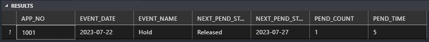
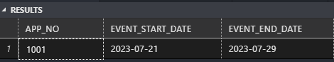

# SQL Code Explanations

<details>
    <summary>1. Event TAT SQL logic </summary>

## SQl query to find the date time difference between two events

> Please refer "Events TAT.sql" for the code used for this example. 

### Step 1: - Get all the Events between start and end event
``` SQL
SELECT 
    * 
INTO #EVENTSLIST
FROM 
    HOLDTIMETAT H1
WHERE EVENT_DATE
    BETWEEN
        (
            SELECT 
                EVENT_DATE
            FROM 
                HOLDTIMETAT H2
            WHERE EVENT_NAME IN ('Event Start')
            AND H1.APP_NO = H2.APP_NO
            AND EVENT_DATE = (
                SELECT 
                    MIN(EVENT_DATE)
                FROM 
                    HOLDTIMETAT H3
                WHERE EVENT_NAME IN('Event Start')
                AND H2.APP_NO = H3.APP_NO
            )
        )
    AND 
    (
            SELECT
                EVENT_DATE
            FROM
                HOLDTIMETAT H2
            WHERE EVENT_NAME IN ('Event End')
            AND H1.APP_NO = H2.APP_NO
            AND EVENT_DATE = (
                SELECT
                    MAX(EVENT_DATE)
                FROM
                    HOLDTIMETAT H3
                WHERE EVENT_NAME IN('Event End')
                AND H2.APP_NO = H3.APP_NO
            )
        )
```

### Step 2 :- Fetch the Hold and Released date to calculate the date difference

```SQL
SELECT
    APP_NO,
    EVENT_DATE,
    EVENT_NAME
INTO #PEND_DATE
FROM #EVENTSLIST
WHERE 
    EVENT_NAME IN ('Hold', 'Released')
ORDER BY 1,2
```

### Step 3 :- Find the number of time the Hold event was triggered and calculate the datedifference between Hold and Released date

```SQL
SELECT 
    A.*, 
    ROW_NUMBER() OVER (PARTITION BY APP_NO ORDER BY EVENT_DATE ASC) AS PEND_COUNT,
    DATEDIFF(DAY,EVENT_DATE, NEXT_PEND_STATE_TIME) AS PEND_TIME
FROM
    (
        SELECT 
            APP_NO,
            EVENT_DATE,
            EVENT_NAME,
            LEAD(EVENT_NAME) OVER (PARTITION BY APP_NO ORDER BY EVENT_NAME ASC) NEXT_PEND_STATE,
            LEAD (EVENT_DATE) OVER (PARTITION BY APP_NO ORDER BY EVENT_DATE ASC) NEXT_PEND_STATE_TIME
        FROM #PEND_DATE
    ) A
WHERE 
    EVENT_NAME = 'Hold' 
    AND NEXT_PEND_STATE = 'Released'
```
> Result :



</details>

<details>
    <summary>2. Row to Column SQL Logic </summary>

### Fetch and save the event start date into a temp table

```SQL
SELECT  
    APP_NO, 
    EVENT_DATE AS EVENT_START_DATE
INTO #START_DATE
FROM HOLDTIMETAT
WHERE EVENT_NAME IN ('Event Start');
```
### Fetch and save the event end date into a temp table

```SQL
SELECT
    APP_NO,
    EVENT_DATE AS EVENT_END_DATE
INTO #END_DATE
FROM HOLDTIMETAT
WHERE EVENT_NAME IN('Event End');
```
### Joing the temp tables with the main table with the application number to get the data in the required format

```SQL
SELECT 
    DISTINCT H1.APP_NO,
    EVENT_START_DATE,
    EVENT_END_DATE
FROM HOLDTIMETAT H1
LEFT JOIN #START_DATE D1
ON H1.APP_NO = D1.APP_NO
LEFT JOIN #END_DATE D2
ON H1.APP_NO = D2.APP_NO
```
> Result :


</details>